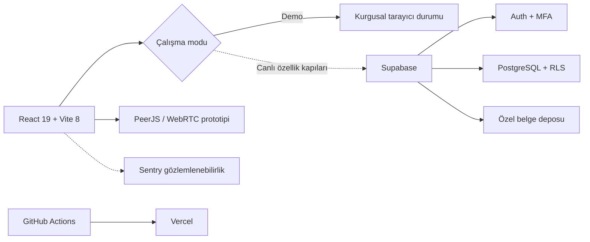

# Saklı Terapi

[](https://github.com/melih-kck/sakli-terapi/actions/workflows/ci.yml)

Saklı Terapi, çevrim içi psikolojik destek deneyiminde mahremiyet kontrolünü ürün tasarımı ve yazılım mimarisiyle ele alan etkileşimli bir portföy projesidir. Uygulama; danışan, uzman ve yönetici yolculuklarını tek bir güvenli demo ortamında gösterir.

**Canlı demo:** [sakli-terapi.vercel.app](https://sakli-terapi.vercel.app/)

> [!IMPORTANT]
> Bu sürüm bir sağlık hizmeti değildir. Gerçek kullanıcı, randevu, ödeme veya klinik kayıt kabul etmez; yalnızca kurgusal veriler kullanır.

## Ürün Deneyimi

- Rumuz temelli danışan profili ve kontrollü gizlilik tercihleri
- Kurgusal uzman kataloğu, filtreleme ve randevu oluşturma akışı
- Metin, ses ve bulanık görüntülü görüşme prototipi
- Blursuz görüntü için açık ve geri alınabilir kullanıcı onayı
- Uzman takvimi, seans yönetimi ve değerlendirme görünümü
- Mesleki belge inceleme, yönetici MFA ve denetim kaydı
- Gerçek kişisel veri gerektirmeyen danışan, uzman ve yönetici demo rolleri

## Teknik Mimari



- **İstemci:** React, React Router ve Vite
- **Veri ve kimlik:** Supabase Auth, PostgreSQL, RLS ve Storage
- **Gerçek zamanlı iletişim:** PeerJS/WebRTC
- **Kalite:** Vitest, React Testing Library, ESLint ve npm audit
- **Operasyon:** GitHub Actions, Vercel ve Sentry

## Güvenlik Yaklaşımı

- Demo modu Supabase veya Sentry'ye demo kullanıcı verisi göndermez.
- Gerçek kayıt, profesyonel başvuru, canlı randevu, canlı seans ve ödeme ayrı özellik kapılarıyla varsayılan olarak kapalıdır.
- Herkese açık uzman görünümü özel kimlik ve belge alanlarından ayrılmıştır.
- Yönetici işlemleri MFA ve denetim kaydıyla sınırlandırılmıştır.
- `SUPABASE_SERVICE_ROLE_KEY` yalnızca güvenilir sunucu ortamında kullanılabilir; hiçbir `VITE_` değişkenine konulamaz.

Ayrıntılı model için [güvenlik belgesine](docs/security-model.md) bakın.

## Yerel Geliştirme

Gereksinim: Node.js `22.22.0` veya üzeri.

```bash
git clone https://github.com/melih-kck/sakli-terapi.git
cd sakli-terapi
npm install
npm run dev
```

Portföy demosu Supabase anahtarı olmadan çalışır. İsteğe bağlı yapılandırma için `.env.example` dosyasını `.env.local` olarak kopyalayın.

Varsayılan güvenli özellik kapıları:

```env
VITE_APP_MODE=demo
VITE_ENABLE_PUBLIC_REGISTRATION=false
VITE_ENABLE_PROFESSIONAL_APPLICATIONS=false
VITE_ENABLE_LIVE_APPOINTMENTS=false
VITE_ENABLE_LIVE_SESSIONS=false
VITE_ENABLE_PAYMENTS=false
```

## Kalite Kontrolleri

```bash
npm audit --omit=dev --audit-level=high
npm run lint
npm test
npm run build
npm run test:e2e
```

Uçtan uca paket; masaüstü ve mobil Chromium'da ana sayfa, dil tercihi, blur onayı, demo rolleri ve seans odası akışını doğrular. Bu kontroller `main` dalına gönderilen her değişiklikte GitHub Actions tarafından yeniden çalıştırılır.

## Proje Yapısı

```text
api/             Güvenilir sunucu uçları
docs/            Güvenlik, operasyon ve teslim belgeleri
public/          Statik demo varlıkları
src/components/  Paylaşılan arayüz bileşenleri
src/context/     Kimlik, profil, seans ve bildirim durumu
src/lib/         Supabase erişimi, güvenlik yardımcıları ve SQL migration'ları
src/pages/       Ziyaretçi, danışan, uzman ve yönetici ekranları
```

## Belgeler

- [Portföy demo rehberi](docs/portfolio-demo-guide.md)
- [Güvenlik modeli](docs/security-model.md)
- [Teslim hazırlığı](docs/release-readiness.md)
- [Operasyon runbook'u](docs/operations-runbook.md)
- [Yedekleme ve geri dönüş](docs/backup-recovery.md)
- [Gerçek cihaz kabul testi](docs/real-device-acceptance.md)

## Üretim Sınırı

`VITE_APP_MODE=live` tek başına gerçek hizmete geçiş anlamına gelmez. Gerçek kullanıcı kabulünden önce hukuki inceleme, klinik yönetişim, veri saklama ve silme kararları, profesyonel doğrulama sorumluluğu, olay yönetimi, doğrulanmış iletişim alanı ve kapalı pilot planı tamamlanmalıdır.

Ödeme bilinçli olarak ertelenmiştir. Ödeme uçları `503 payments_disabled` döndürür ve arayüz finansal veri toplamaz.

## Güvenlik Bildirimi

Bir güvenlik sorunu fark ederseniz herkese açık issue açmayın. [Özel güvenlik bildirimi](https://github.com/melih-kck/sakli-terapi/security/advisories/new) kullanın.

## Lisans

Kaynak kodu portföy incelemesi amacıyla herkese açıktır. Yeniden kullanım veya dağıtım izni verilmemiştir; ayrıntılar için [LICENSE](LICENSE) dosyasına bakın.
