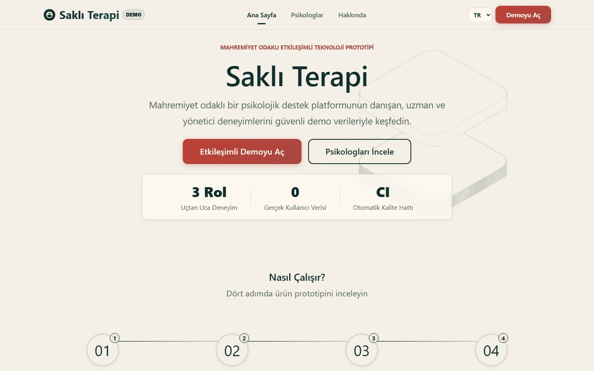
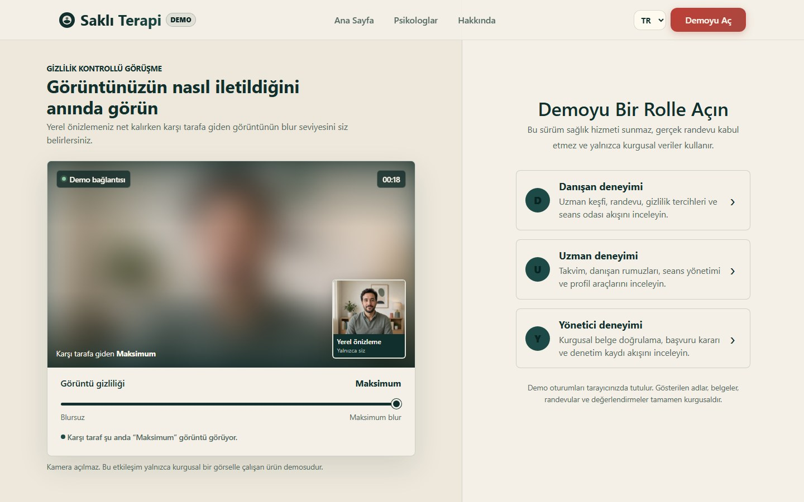
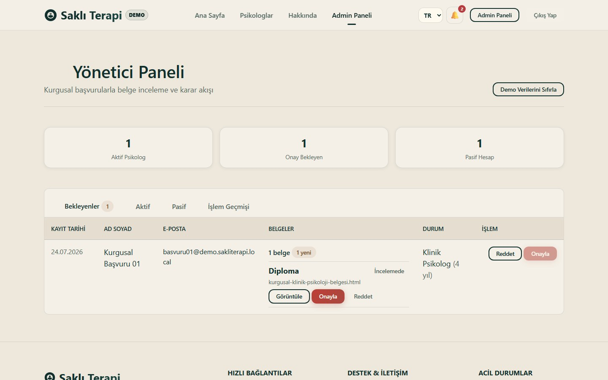
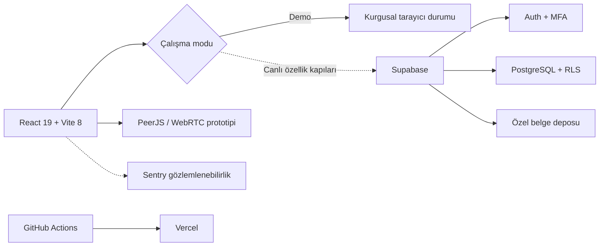

# Saklı Terapi

[](https://github.com/melih-kck/sakli-terapi/actions/workflows/ci.yml)

Saklı Terapi, çevrim içi psikolojik destek deneyiminde mahremiyet kontrolünü ürün tasarımı ve yazılım mimarisiyle ele alan etkileşimli bir teknoloji prototipidir. Uygulama; danışan, uzman ve yönetici yolculuklarını tek bir güvenli demo ortamında gösterir.

**Canlı demo:** [sakli-terapi.vercel.app](https://sakli-terapi.vercel.app/)

> [!IMPORTANT]
> Bu sürüm bir sağlık hizmeti değildir. Gerçek kullanıcı, randevu, ödeme veya klinik kayıt kabul etmez; yalnızca kurgusal veriler kullanır.

## Ürüne Bakış



| Gizlilik kontrollü görüşme | Yönetici belge inceleme |
|---|---|
|  |  |

## Beş Dakikalık Değerlendirme Rotası

1. Ana sayfada ürün hipotezini, demo sınırını ve mahremiyet yaklaşımını inceleyin.
2. `Demoyu Aç` üzerinden danışan rolüne girip uzman keşfi ve kurgusal randevu akışını deneyin.
3. Seans odasında blur seviyesini değiştirin; blursuz görüntü için gereken açık onayı doğrulayın.
4. Uzman rolünde takvim, rumuzla temsil edilen danışan ve seans yönetimini inceleyin.
5. Yönetici rolünde kurgusal belgeyi görüntüleyin, karar akışını ve denetim kaydını izleyin.

Detaylı anlatım için [demo inceleme rehberine](docs/portfolio-demo-guide.md) bakın.

## Ürün Deneyimi

- Rumuz temelli danışan profili ve kontrollü gizlilik tercihleri
- Kurgusal uzman kataloğu, filtreleme ve randevu oluşturma akışı
- Metin, ses ve bulanık görüntülü görüşme prototipi
- Blursuz görüntü için açık ve geri alınabilir kullanıcı onayı
- Uzman takvimi, seans yönetimi ve değerlendirme görünümü
- Mesleki belge inceleme, yönetici MFA ve denetim kaydı
- Gerçek kişisel veri gerektirmeyen danışan, uzman ve yönetici demo rolleri

## Teknik Mimari


```mermaid
flowchart LR
    UI["React 19 + Vite 8"] --> MODE{"Çalışma modu"}
    MODE -->|Demo| LOCAL["Kurgusal tarayıcı durumu"]
    MODE -.->|Canlı özellik kapıları| SB["Supabase"]
    SB --> AUTH["Auth + MFA"]
    SB --> DB["PostgreSQL + RLS"]
    SB --> STORAGE["Özel belge deposu"]
    UI --> RTC["PeerJS / WebRTC prototipi"]
    UI -.-> MON["Sentry gözlemlenebilirlik"]
    CI["GitHub Actions"] --> DEPLOY["Vercel"]
```

- **İstemci:** React, React Router ve Vite
- **Veri ve kimlik:** Supabase Auth, PostgreSQL, RLS ve Storage
- **Gerçek zamanlı iletişim:** PeerJS/WebRTC
- **Kalite:** Vitest, React Testing Library, Playwright, axe-core, ESLint ve npm audit
- **Operasyon:** GitHub Actions, Vercel ve Sentry

## Güvenlik Yaklaşımı

- Demo modu Supabase veya Sentry'ye demo kullanıcı verisi göndermez.
- Gerçek kayıt, profesyonel başvuru, canlı randevu, canlı seans ve ödeme ayrı özellik kapılarıyla varsayılan olarak kapalıdır.
- Herkese açık uzman görünümü özel kimlik ve belge alanlarından ayrılmıştır.
- Yönetici işlemleri MFA ve denetim kaydıyla sınırlandırılmıştır.
- `SUPABASE_SERVICE_ROLE_KEY` yalnızca güvenilir sunucu ortamında kullanılabilir; hiçbir `VITE_` değişkenine konulamaz.

Ayrıntılı model için [güvenlik belgesine](docs/security-model.md) bakın.

## Yerel Geliştirme

Önerilen ortam: Node.js `24.15.0` veya üzeri bir `24.x` sürümü (CI da Node 24 kullanır). Desteklenen aralıklar: `22.22.2+` (22.x), `24.15.0+` (24.x) veya `26.0.0+`.

```bash
git clone https://github.com/melih-kck/sakli-terapi.git
cd sakli-terapi
npm ci
npm run dev
```

Demo sürümü Supabase anahtarı olmadan çalışır. İsteğe bağlı yapılandırma için `.env.example` dosyasını `.env.local` olarak kopyalayın.

Varsayılan güvenli özellik kapıları:

```env
VITE_APP_MODE=demo
VITE_ENABLE_PUBLIC_REGISTRATION=false
VITE_ENABLE_PROFESSIONAL_APPLICATIONS=false
VITE_ENABLE_LIVE_APPOINTMENTS=false
VITE_ENABLE_LIVE_SESSIONS=false
VITE_ENABLE_PAYMENTS=false
```

## Kalite Kontrolleri

```bash
npm audit --audit-level=low
npm audit signatures
npm run lint
npm test
npm run build
npm run test:e2e
```

| Katman | Otomatik kapsam |
|---|---|
| Birim ve bileşen | 95 Vitest testi |
| Kritik ürün yolculukları | 7 senaryo × 5 tarayıcı/cihaz profili |
| Sayfa sağlığı | 15 açık ve rol tabanlı rota × masaüstü/mobil Chromium |
| Tarayıcılar | Chromium, Firefox ve WebKit |
| Mobil | Pixel 7 Chromium ve iPhone 15 WebKit |
| Erişilebilirlik | 15 açık ve rol tabanlı ekran × masaüstü/mobil WCAG A ve AA taraması |
| Klavye ve ekran okuyucu | 9 klavye ve ARIA sözleşmesi × 5 tarayıcı/cihaz profili |
| Performans | 150 KiB başlangıç aktarım bütçesi |
| Güvenlik ve teslim | ESLint, tam bağımlılık denetimi, paket imza doğrulaması ve Vite production build |

Uçtan uca paket; ana sayfa, kalıcı dil tercihi, blur onayı, üç demo rolü, belge görüntüleme ve seans odası akışını doğrular. Erişilebilirlik kontrolleri axe-core ile otomatikleştirilmiştir; otomatik tarama manuel klavye ve yardımcı teknoloji değerlendirmesinin yerini tutmaz.

Tüm kontroller `main` dalına gönderilen her değişiklikte GitHub Actions tarafından yeniden çalıştırılır. Derleme sonrasında başlangıç performans bütçesini doğrulamak için `npm run check:performance`, belge görsellerini güncel yerel demo üzerinden yeniden üretmek için geliştirme sunucusu açıkken `npm run screenshots:portfolio` komutunu kullanın.

React, React DOM ve ilgili type paketleri Dependabot tarafından ayrı bir grupta güncellenir ve genel npm grubundan açıkça dışlanır. React 19.3 geçişi başlangıç aktarım bütçesini aştığı için 19.2.x korunur; güvenlik güncellemeleri kapatılmadan yeni sürümler aynı kalite kontrolleriyle ayrıca değerlendirilir.

## Proje Yapısı

```text
api/             Güvenilir sunucu uçları
docs/            Güvenlik, operasyon ve teslim belgeleri
public/          Statik demo varlıkları
src/components/  Paylaşılan arayüz bileşenleri
src/context/     Kimlik, profil, seans ve bildirim durumu
src/lib/         Supabase erişimi, güvenlik yardımcıları ve SQL migration'ları
src/pages/       Ziyaretçi, danışan, uzman ve yönetici ekranları
e2e/             Çapraz tarayıcı ve erişilebilirlik kabul testleri
scripts/         Tekrarlanabilir demo görseli üretimi
```

## Belgeler

- [Demo inceleme rehberi](docs/portfolio-demo-guide.md)
- [Güvenlik modeli](docs/security-model.md)
- [Teslim hazırlığı](docs/release-readiness.md)
- [Operasyon runbook'u](docs/operations-runbook.md)
- [Yedekleme ve geri dönüş](docs/backup-recovery.md)
- [Gerçek cihaz kabul testi](docs/real-device-acceptance.md)

## Üretim Sınırı

`VITE_APP_MODE=live` tek başına gerçek hizmete geçiş anlamına gelmez. Gerçek kullanıcı kabulünden önce hukuki inceleme, klinik yönetişim, veri saklama ve silme kararları, profesyonel doğrulama sorumluluğu, olay yönetimi, doğrulanmış iletişim alanı ve kapalı pilot planı tamamlanmalıdır.

Ödeme bilinçli olarak ertelenmiştir. Ödeme uçları `503 payments_disabled` döndürür ve arayüz finansal veri toplamaz.

## Güvenlik Bildirimi

Bir güvenlik sorunu fark ederseniz herkese açık issue açmayın. [Özel güvenlik bildirimi](https://github.com/melih-kck/sakli-terapi/security/advisories/new) kullanın.

## Lisans

Kaynak kodu teknik ve akademik inceleme amacıyla herkese açıktır. Yeniden kullanım veya dağıtım izni verilmemiştir; ayrıntılar için [LICENSE](LICENSE) dosyasına bakın.
